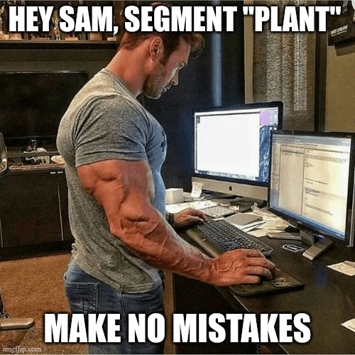

# Camp QMIND Demo Day!

Welcome everyone! Today we will be working on a little demo of our project to showcase that it is viable & computable.

## What we will be doing

CanopyMap is made up of 3 main segments:

- Data
- Segmentation Model
- Tracking
- Presentation (Camp QMIND pitch competition)

We are going to make an MVP of our project
> *What is MVP you ask?* it stands for Minimum Viable Product; It asks us to boil down our project to its defining features, that are essential to its meaning and cannot be removed. 

We are going to use a BIG ASS image segmentation model to pick out parts of the pictures that have plants in them, and using that we will _try_ to estimate growth using highschool formulas.

### 1. Data

We are going to make a small dataset of plants growing over time, bonus if it's in a vertical farm. 

For our data we will try to find a set of images on google that satisfy these requirements:
- Only one plant is needed, like 10 pictures. (bonus if it has its mass).
- The pictures are sufficiently apart (time wise) so that growth can be seen.
- The plant is somewhat easy to pick out and does not have other plants interrupting the picture.
- The pictures are somewhat consistent from one to the other so our tracking will be easier and more consistent

In this part you will be using a jupyter notebook with `Google Colab` to load all of the pictures and running some pre-processing algorithms on them such as:
- Black and white filter
- Reducing their resolution if necessary
- Running a "Green pixel" filter as a baseline to compare with the AI model.

### 2. Segmentation Model

We are going to try to run `SAM3` from facebook on a colab notebook and mess around with it to try to get it to segment things for us

#### SAM? who let sam cook

- SAM stands for *Segment Anything Model* which means you can throw anything at it.
- SAM3 takes in a text prompt as an additional input which lets us prompt the model about what to segment. For example the text prompt can be "nose" and we give it a portrait, it will segment the portion of the image that is the nose and give it back to us.

In this part we will be using jupyter notebooks with `Google Colab` to get the AI model loaded onto a GPU. it's very simple since facebook has left us with a bunch of examples. We may also have to play with the text prompt to see which one will get us the best masking, as well as try to see if we can get individual masking of each plant part.

### 3. Tracking

For our actual project we are going to use more sphosticated tracking algorithms that include factors such as pixel matching, pixel adaptation and require individual segments of a single plant (stem, root, leaves, ...) to work properly as we are tracking each individual segment. This require more knowledge and time to get setup and get working properly, so as an MVP we are going to take a simpler approach.

#### ok so what is the simpler approach?

We are going to figure this out together! we need to find a dataset or reference that has pictures of plants and their respective biomass. Using this we can make a simple linear/non-linear regression based off of how big the mask is in the picture. It won't be super duper accurate, but it will be good enough for an MVP. Alternatively we could also find a github repo that does this already and we'd save ourselves a lot of time.

In this part you will use google & AI to find already existing ways to measure plant growth from a picture, or related formulas, and make a small report in .md format that we will put in the github under docs/tracking/biomass_estimation.md and use it during this MVP and later in the project as a baseline. 

### 4. Presentation (Pitch competition)

We are going to make a presentation that's HYPE. It will be pretty short because we have our demo to show but we are hoping to get the *Best Presentation* award in the end. 

Our pitch will include:
- Team introduction
- Why are we even building a pipeline like this
- How are we doing it
- DEMO
